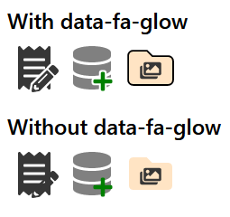

# fa-glow

The missing option to outline layered icons when using
[Font Awesome](https://fontawesome.com/) SVG+JS.



## Usage

This small CSS file works with the SVG+JS version of Font Awesome,
and was tested with version 5.  It may work with version 6, though has not been tested.

```html
<head>
  <link rel="stylesheet" href="path/to/fa-glow/fa-glow.min.css" />
</head>
<body>
  <span class="fa-layers fa-fw fa-3x" aria-hidden="true">
    <i class="fas fa-database" style="color:grey"></i>
    <i class="fas fa-plus" data-fa-glow="9" data-fa-transform="shrink-8 down-5 right-4" style="color:green"></i>
  </span>

  <script src="path/to/font-awesome/js/all.min.js"></script>
</body>
```

## Options

Attributes are added to the icon elements.

`data-fa-glow`

-   Adds an outline to the icon using the default width (8).

`data-fa-glow="5"`

-   Adds an outline to the icon with 10 times the width set.
-   Whole numbers between 1 and 10 are accepted.

`style="--fa-glow-color:red"`

-   Sets the color of the outline.
-   When unset, the default color (white) will be used.

## Need `fa-glow` with the CSS version of Font Awesome?

[fa5-power-transforms-css](https://github.com/cityssm/fa5-power-transforms-css)
offers a lot of Font Awesome's Power Transform functionality,
including limited support for the `data-fa-glow` attribute.
